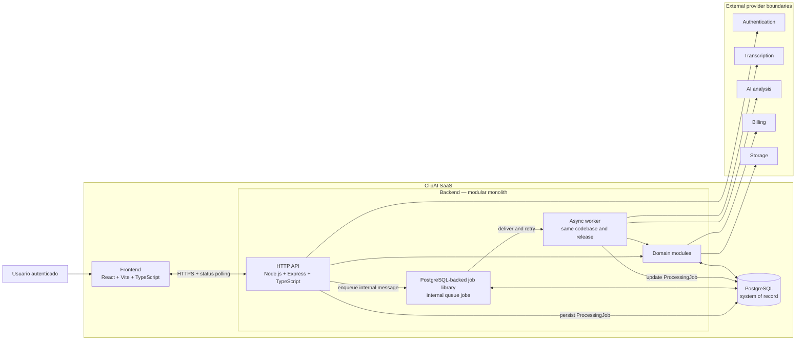

# ClipAI SaaS — Architecture Foundation

## 1. Estado y propósito del documento

| Campo | Valor |
| --- | --- |
| Documento | 02 — Architecture Foundation |
| Versión | 0.1 |
| Estado | Aprobado como arquitectura objetivo inicial |
| Estado de implementación | No implementada |
| Fase | Fase 0 — Foundation |
| Última actualización | 2026-06-26 |

Este documento define la arquitectura objetivo inicial del MVP de ClipAI y los
límites técnicos que deberán respetarse cuando se autorice su construcción. No
autoriza por sí mismo el desarrollo del SaaS completo, no constituye una
especificación de API ni afirma que los componentes descritos estén
implementados.

La arquitectura se apoya en el Product Charter, el working agreement del
repositorio y las decisiones aprobadas para la Fase 0. El prototipo ubicado en
`legacy/` se utiliza únicamente como referencia de producto y presentación.
No es una base de código de producción ni una fuente de decisiones técnicas.

En este documento:

- **Aprobado** identifica una dirección que forma parte de la arquitectura
  objetivo inicial.
- **Pendiente** identifica una decisión que todavía requiere validación o una
  elección posterior.
- **Estado actual** describe únicamente lo que existe hoy en el repositorio.

Los nombres de carpetas, módulos, entidades, estados e interfaces se mantienen
en inglés aunque la documentación esté escrita en español.

## 2. Principios arquitectónicos

1. **Monolito modular.** El frontend y el backend tendrán despliegues
   diferenciados, pero el dominio del backend vivirá en una sola base de código,
   una sola unidad de release y una base de datos compartida. Un proceso worker
   del mismo backend no constituye un microservicio.
2. **Simplicidad operativa.** La arquitectura deberá poder ser construida,
   entendida y operada por dos fundadores. Se preferirán componentes conocidos y
   pocas piezas desplegables.
3. **Backend autoritativo.** Autorización, reglas de negocio, consumo, acceso a
   datos, llamadas a proveedores y validación de resultados pertenecerán al
   servidor. La validación del frontend será solo una ayuda de experiencia.
4. **Procesamiento asíncrono durable.** La adquisición de transcript y el
   análisis con IA no mantendrán abierta una petición HTTP. Su progreso quedará
   representado mediante estado persistido.
5. **PostgreSQL como system of record.** El estado de negocio, procesamiento y
   uso deberá poder reconstruirse desde PostgreSQL. Un proveedor externo no será
   la fuente autoritativa del dominio.
6. **Límites de proveedor estrechos.** Se aislarán autenticación, transcripción,
   IA, billing y storage detrás de adaptadores orientados a la capacidad. No se
   construirá un framework genérico de plugins.
7. **Aislamiento por Workspace.** Los recursos privados se asociarán a un
   `Workspace`, incluso cuando el MVP solo permita un workspace personal por
   usuario.
8. **Evolución basada en evidencia.** Escalado, nuevas piezas de infraestructura
   y extracción de servicios ocurrirán solo ante límites medidos, no por
   anticipación.

## 3. Contexto del sistema

El actor principal es una persona autenticada que trabaja con contenido largo
propio o autorizado. En el MVP, esa persona tendrá un `Workspace` personal,
creará proyectos, enviará una fuente soportada, seguirá el procesamiento y
consultará recomendaciones estratégicas.

ClipAI recibirá referencias o entradas autorizadas, obtendrá una transcripción
temporizada por un mecanismo permitido, validará sus segmentos y generará un
resultado estructurado. El producto entregará recomendaciones editoriales con
rangos temporales verificables; no cortará, renderizará ni entregará archivos de
video editados.

El sistema dependerá de capacidades externas para autenticación,
transcripción, IA, billing y, si los tipos de entrada lo requieren, storage.
Esos sistemas se considerarán fuera del límite de confianza de ClipAI. El
backend será responsable de autenticar sus respuestas, normalizar errores y
validar cualquier dato recibido.

## 4. Diagrama de componentes de alto nivel



No existirá una conexión directa desde el navegador hacia proveedores de IA o
transcripción. El diagrama muestra límites lógicos, no proveedores elegidos ni
recursos de infraestructura ya creados.

## 5. Estructura del repositorio

La estructura raíz aprobada es:

```text
client/   # Aplicación frontend
server/   # API y worker del backend
docs/     # Documentación de producto y técnica
legacy/   # Prototipos históricos usados solo como referencia
```

Cuando se autorice la implementación, la forma interna esperada será:

```text
client/
  src/
    app/
    features/
    components/
    lib/

server/
  src/
    modules/
      auth/
      workspaces/
      projects/
      analysis/
      jobs/
      usage/
    providers/
      authentication/
      transcription/
      ai/
      billing/
      storage/
    shared/
    app.ts
    server.ts
    worker.ts

docs/
legacy/
```

Esta estructura es una guía, no una orden de crear carpetas vacías. Cada módulo
añadirá routes, controllers, services y data access cuando exista una necesidad
real. `shared/` se limitará a capacidades transversales como configuración,
logging, errores y acceso a base de datos; no será un contenedor genérico de
lógica de negocio.

Los builds de producción tendrán como raíz exclusiva `client/` o `server/`.
`legacy/` no se importará, copiará, empaquetará ni incluirá en build contexts.
Del prototipo actual solo pueden conservarse ideas de experiencia como el envío
de una fuente, el progreso visible y las tarjetas de resultados. No se
trasladarán sus llamadas directas desde el navegador, su búsqueda de
transcripciones de terceros, sus timestamps estimados, su parsing no validado
ni sus afirmaciones de viralidad.

## 6. Responsabilidades del frontend

El frontend será responsable de:

- Presentar registro, acceso y estado de sesión según el contrato del backend.
- Mostrar el workspace personal, los proyectos, el historial y el consumo.
- Recibir una fuente soportada y una confirmación explícita de propiedad o
  autorización.
- Aplicar validaciones de experiencia antes de enviar, sin sustituir la
  validación del servidor.
- Iniciar el análisis y consultar periódicamente su estado mediante HTTPS.
- Mostrar estados de espera, progreso, `awaiting_input`, error y finalización.
- Solicitar la entrada alternativa autorizada cuando falte un transcript
  utilizable.
- Presentar resumen, tema principal y `ClipRecommendation` verificables.

El frontend no almacenará secretos, decidirá autorizaciones, reservará
créditos, consultará directamente PostgreSQL, llamará a proveedores de IA o
transcripción, ni aceptará como válido un resultado solo porque pasó una
validación de cliente.

## 7. Responsabilidades del backend

El backend será responsable de:

- Exponer la interfaz HTTP consumida por el frontend.
- Autenticar cada solicitud y autorizar cada recurso dentro de su
  `Workspace`.
- Validar inputs, tipos de fuente y la attestation de contenido autorizado.
- Crear y mantener proyectos, fuentes, jobs, transcripts, análisis y consumo.
- Reservar, liquidar o liberar uso de forma idempotente.
- Ejecutar el flujo asíncrono mediante un worker del mismo monolito.
- Encapsular las integraciones externas y sus credenciales.
- Normalizar transcripts y validar segmentos temporizados.
- Validar la salida estructurada de IA antes de persistirla o mostrarla.
- Traducir fallos internos a estados y mensajes seguros para el usuario.

Los controllers adaptarán HTTP, los services contendrán los casos de uso y la
capa de data access concentrará la persistencia. Las decisiones de dominio no
se colocarán en routes, controllers ni adaptadores de proveedor.

## 8. Estructura propuesta de módulos del backend

| Módulo | Responsabilidad |
| --- | --- |
| `auth` | Mapear la identidad autenticada a `User`, mantener el contexto de sesión y aplicar reglas comunes de autenticación. |
| `workspaces` | Administrar el límite de tenant y comprobar acceso a `Workspace`. En el MVP creará o asociará un workspace personal. |
| `projects` | Administrar `Project`, `Source` y `OwnershipAttestation`, incluidos sus estados visibles. |
| `analysis` | Normalizar y validar `Transcript` y `TranscriptSegment`; producir y validar `Analysis` y `ClipRecommendation`. |
| `jobs` | Administrar el ciclo de vida de negocio de `ProcessingJob` e integrar la librería de jobs seleccionada. No implementará el motor interno de la cola ni será dueño del resultado de análisis. |
| `usage` | Comprobar disponibilidad, crear `UsageReservation` y registrar `UsageLedgerEntry`; coordinar el límite de billing. |
| `providers` | Implementar adaptadores de capacidades externas sin poseer reglas ni datos del dominio. |

Los módulos colaborarán mediante services explícitos y no mediante acceso
arbitrario a las tablas de otro módulo. Se evitarán dependencias circulares. El
worker invocará casos de uso de estos mismos módulos en lugar de duplicar
lógica.

## 9. Responsabilidad de la base de datos y propiedad de datos

PostgreSQL será el system of record. Solo el backend accederá a la base de
datos; ni el navegador ni los proveedores externos tendrán acceso directo.
Prisma es el ORM planificado, pero su schema y el diseño físico de tablas
permanecen fuera del alcance de esta fase.

El modelo conceptual incluye:

| Concepto | Propiedad y propósito |
| --- | --- |
| `User` | Representación interna de una identidad autenticada. |
| `Workspace` | Límite de tenant y propiedad de recursos privados. |
| `Project` | Contenedor del trabajo asociado a una fuente y sus análisis. |
| `Source` | Referencia y metadata de una entrada autorizada. |
| `OwnershipAttestation` | Evidencia de quién confirmó autorización, cuándo y para qué fuente. No reemplaza controles legales. |
| `Transcript` | Transcript normalizado adquirido por un mecanismo soportado. |
| `TranscriptSegment` | Texto asociado a un rango temporal real y validado. |
| `Analysis` | Resultado estructurado de una ejecución válida. |
| `ClipRecommendation` | Momento recomendado, rango temporal, título, hook, plataformas y rationale. |
| `ProcessingJob` | Registro durable de una operación de análisis solicitada por el usuario y de su estado visible. |
| `UsageReservation` | Capacidad apartada temporalmente para un job. |
| `UsageLedgerEntry` | Registro inmutable de reserva, liquidación, liberación o ajuste. |

Todo recurso privado incluirá conceptualmente `workspaceId`; el servidor
obtendrá ese alcance desde el contexto autenticado y no confiará en un valor
enviado libremente por el cliente. El MVP mantendrá una relación personal entre
usuario y workspace. Las membresías y roles de equipos se diseñarán cuando esa
funcionalidad sea autorizada.

La base de datos conservará metadata, estado, referencias, resultados y el
ledger de uso. Los archivos binarios grandes no se guardarán en PostgreSQL. La
representación física del transcript, su política de retención y la necesidad
de storage externo son decisiones pendientes.

## 10. Modelo de procesamiento asíncrono

La petición que inicia un análisis devolverá una aceptación después de
persistir el trabajo; no esperará la transcripción ni la respuesta de IA. Un
proceso `worker.ts`, construido y versionado con el mismo backend, ejecutará
el trabajo fuera del ciclo HTTP.

El diseño distingue dos conceptos:

- `ProcessingJob` es el registro de negocio durable que representa una sola
  operación de análisis solicitada por el usuario. Conserva el estado visible,
  la relación con `Project`, los resultados y la liquidación de uso.
- Un queue job es el mensaje interno de ejecución administrado por la librería
  de jobs. Contiene la referencia necesaria para que el worker procese un
  `ProcessingJob`; puede ejecutarse o reintentarse más de una vez sin crear
  otro análisis, proyecto o movimiento de uso.

Cuando se implemente el procesamiento asíncrono se utilizará una librería madura
de jobs respaldada por PostgreSQL. La selección de esa librería permanece
pendiente. La librería será responsable de entregar mensajes a los workers y de
sus mecanismos internos de concurrencia, locking o heartbeat, reintentos
programados y recuperación de ejecuciones interrumpidas.

ClipAI no implementará un sistema propio de queue claiming, heartbeat, lease
renewal, retry scheduling ni abandoned-job recovery. Esas capacidades solo
podrían reconsiderarse si un requisito posterior, medido y documentado
demuestra que la librería elegida no puede cubrirlas.

La aplicación persistirá `ProcessingJob`, publicará un queue job que lo
referencie y actualizará el estado de negocio al avanzar por adquisición,
validación, análisis y finalización. La integración deberá usar las garantías
documentadas de la librería y mantener idempotentes los efectos de dominio.

Los estados conceptuales mínimos serán `queued`, `processing`,
`awaiting_input`, `completed` y `failed`. Todavía no constituyen un
contrato público de API. `awaiting_input` no ocupará un worker mientras se
espera al usuario. Cuando llegue la entrada requerida se podrá publicar otro
queue job para continuar el mismo `ProcessingJob`.

Las operaciones con efectos deberán ser idempotentes por `ProcessingJob`.
Cada intento comprobará el estado durable antes de producir efectos, y una
reentrega no duplicará resultados, reservas ni liquidaciones. Los errores
transitorios podrán reintentarse según la configuración de la librería; los
errores permanentes actualizarán el registro de negocio sin programar trabajo
inútil.

PostgreSQL continuará siendo el system of record y el estado de procesamiento
permanecerá persistido con independencia de los intentos internos. Redis no es
necesario para el MVP inicial. La librería o queue vendor, sus timeouts, su
política de reintentos y sus límites operativos permanecen pendientes.

## 11. Límites de proveedores externos

Los nombres siguientes describen contratos conceptuales; no son interfaces
TypeScript implementadas:

| Límite | Contrato conceptual |
| --- | --- |
| `AuthenticationProvider` | Validar o intercambiar identidad y entregar una referencia estable. La autorización de dominio permanece en ClipAI. |
| `TranscriptionProvider` | Recibir una entrada soportada y devolver un transcript temporizado normalizado o un fallo clasificable. No buscará copias mediante scraping no autorizado. |
| `AiAnalysisProvider` | Recibir transcript validado e instrucciones internas y devolver una salida estructurada candidata. No escribirá en la base de datos. |
| `BillingProvider` | Comunicar estado comercial y eventos de pago. El ledger de uso y la autorización de un análisis permanecen en ClipAI. |
| `StorageProvider` | Guardar y recuperar objetos autorizados mediante referencias opacas y acceso de duración limitada. |

Cada capacidad comenzará con un solo adaptador concreto cuando se elija un
proveedor. Los adaptadores traducirán credenciales, timeouts, errores y payloads
externos a conceptos internos. No se crearán abstracciones para soportar
cambios hipotéticos que no aporten una frontera de seguridad, prueba o negocio.

Todas las credenciales y llamadas privilegiadas vivirán en el servidor. La
selección de proveedores y sus modelos específicos permanece pendiente.

## 12. Flujo inicial de una solicitud de análisis

1. **Envío autorizado.** El usuario autenticado envía una `Source` soportada y
   confirma que posee el contenido o tiene autorización suficiente para
   procesarlo.
2. **Validación.** El backend valida sesión, acceso al workspace, formato,
   soporte de la fuente y presencia de `OwnershipAttestation`. La attestation
   queda registrada, pero no se interpreta como garantía legal.
3. **Creación durable.** El backend crea `Project`, `Source`,
   `OwnershipAttestation` y `ProcessingJob` en estado `queued`. La
   operación deberá ser idempotente ante reenvíos del cliente.
4. **Reserva de uso.** El módulo `usage` comprueba elegibilidad y capacidad y
   crea una `UsageReservation`. Si no puede reservar, el procesamiento externo
   no comienza y no se liquida consumo. Cuando la reserva es válida, el backend
   publica un queue job interno que referencia el mismo `ProcessingJob`.
5. **Adquisición del transcript.** La librería entrega el queue job a un worker,
   que carga el `ProcessingJob` e intenta obtener un transcript mediante un
   mecanismo soportado. Si no existe uno utilizable, cambia el registro de
   negocio a `awaiting_input` y el frontend solicita una entrada permitida,
   como archivo de video, audio o transcript temporizado. El intento interno
   termina sin perder el estado persistido.
6. **Validación temporal.** El backend normaliza y valida
   `TranscriptSegment`: texto requerido, timestamps no negativos, rangos
   coherentes y orden temporal. Sin segmentos temporizados confiables no se
   genera un resultado final.
7. **Análisis asíncrono.** `AiAnalysisProvider` recibe únicamente el contexto
   necesario y genera recomendaciones estratégicas. El modelo no tiene
   autoridad para inventar timestamps ni modificar consumo.
8. **Validación estructurada.** El backend valida el schema lógico, los campos
   requeridos y que cada rango recomendado pueda sustentarse en segmentos del
   transcript. Una respuesta de proveedor se considera no confiable hasta
   superar esta validación.
9. **Persistencia.** Una operación consistente guarda `Transcript`,
   `Analysis`, `ClipRecommendation`, estado final de `ProcessingJob` y los
   movimientos de uso correspondientes.
10. **Presentación.** El frontend consulta el estado. Ante
    `awaiting_input` muestra la acción requerida; ante `completed` obtiene y
    presenta el resultado; ante `failed` muestra un mensaje seguro y una
    acción posible.
11. **Liquidación.** Un resultado válido liquida la reserva una sola vez. Un
    `ProcessingJob` que no produce un resultado válido libera la reserva. La
    operación es idempotente y queda registrada en `UsageLedgerEntry`; los
    reintentos del queue job no generan nuevos cargos. La política comercial
    para costes parciales del proveedor permanece pendiente.

El resultado contendrá resumen, tema principal y recomendaciones priorizadas
con timestamps verificables, título, hook, plataformas sugeridas y rationale.
No incluirá archivos editados ni afirmará garantizar alcance o viralidad.

## 13. Límites de seguridad

- **Autenticación y autorización separadas.** El proveedor puede probar
  identidad; ClipAI decide acceso. Cada lectura o escritura comprobará
  `workspaceId` en el servidor.
- **Attestation auditable.** La aceptación de contenido autorizado registrará
  usuario, fuente, momento y versión del texto aceptado.
- **Secretos server-side.** API keys, credenciales de base de datos, secretos de
  webhook y tokens privilegiados se cargarán desde variables de entorno o un
  secret manager. `.env.example` nunca contendrá valores reales.
- **Fuentes no confiables.** URLs, nombres de archivo y metadata se validarán.
  El backend no realizará fetch arbitrario: aplicará protocolos y destinos
  permitidos, resolución segura y defensas contra SSRF.
- **Uploads controlados.** Si se habilitan, exigirán autorización previa,
  límites de tipo, tamaño y duración, referencias opacas y acceso temporal. Los
  límites exactos están pendientes.
- **Contenido y prompts no confiables.** Transcript y metadata se tratarán como
  datos, no como instrucciones. Los prompts del sistema serán server-side y la
  salida estructurada se validará antes de usarla.
- **Proveedores no confiables.** Respuestas, callbacks y webhooks se verificarán
  por schema, autenticidad e idempotencia.
- **Protección de datos.** Se exigirá cifrado en tránsito y, donde aplique, en
  reposo, además de permisos mínimos para base de datos, storage y proveedores.
- **Logs minimizados.** No se registrarán secretos, tokens, archivos completos,
  prompts completos ni transcripts por defecto.

Las políticas definitivas de privacidad, retención, eliminación, región y
respuesta a incidentes están pendientes antes del lanzamiento.

## 14. Observabilidad y manejo de errores

El backend emitirá logs estructurados con `requestId`, `workspaceId`,
`projectId`, `processingJobId`, el identificador interno del queue job
cuando sea útil, etapa, duración y resultado. Los identificadores permitirán
seguir una solicitud desde HTTP hasta el worker sin registrar el contenido
procesado.

Como mínimo se medirán:

- conteos y latencia de `ProcessingJob` por estado y etapa;
- métricas expuestas por la librería sobre queue jobs, reintentos, fallos y
  trabajo atascado;
- errores y latencia por límite de proveedor;
- tiempo total hasta resultado o acción requerida;
- unidades técnicas y coste variable por análisis;
- reservas, liquidaciones y liberaciones de uso; y
- tasa de resultados estructurados rechazados por validación.

Los errores se clasificarán conceptualmente como `validation`,
`authentication`, `authorization`, `provider_transient`,
`provider_permanent` e `internal`. El usuario recibirá un mensaje seguro,
un estado estable y, cuando corresponda, una acción o posibilidad de reintento;
los detalles internos permanecerán en observabilidad.

API y worker expondrán señales de salud y disponibilidad apropiadas para su
entorno. La herramienta de logging, métricas y alertas y los umbrales
operativos permanecen pendientes.

## 15. Forma de despliegue para el MVP

El despliegue objetivo mínimo tendrá:

1. un frontend estático construido desde `client/`;
2. un proceso HTTP construido desde `server/`;
3. uno o más procesos worker construidos desde el mismo código y versión del
   backend;
4. una instancia PostgreSQL con backups configurados;
5. storage de objetos solo si las entradas soportadas lo requieren; y
6. conexiones salientes server-side hacia los proveedores elegidos.

API y worker compartirán módulos, modelo de datos y ciclo de release, aunque
puedan ejecutarse como procesos separados y escalarse de forma independiente.
El despliegue inicial será de una sola región. La región, plataforma de hosting,
topología de red, storage y mecanismo de gestión de secretos están pendientes.

No se requieren Kubernetes, service mesh, Redis, un event bus ni despliegue
multi-region. Cuando exista Prisma, las migraciones se ejecutarán como un paso
controlado de release, pero no se define ningún schema en esta fase.

## 16. Enfoque de escalabilidad

La primera respuesta al crecimiento será medir y optimizar el monolito:

1. ajustar consultas, índices y límites de conexión de PostgreSQL;
2. aumentar recursos verticalmente cuando sea la opción más simple;
3. incrementar de forma controlada la concurrencia del worker según coste,
   cuotas y latencia de proveedores;
4. añadir réplicas stateless de la API cuando el tráfico HTTP lo exija; y
5. almacenar objetos grandes fuera de PostgreSQL cuando entren en el alcance.

Los índices del estado de negocio se diseñarán para consultar proyectos y
`ProcessingJob` por workspace, estado y tiempo. La librería de jobs
administrará su propia concurrencia y coordinación entre workers de acuerdo con
sus mecanismos documentados; ClipAI no duplicará esos mecanismos.

Reemplazar la librería PostgreSQL-backed por otro sistema de cola, además de
particionado, réplicas de lectura o separación de servicios, solo se
considerará con métricas que demuestren un cuello de botella o un requisito
operativo que el diseño inicial no pueda resolver. El crecimiento de equipos no
exigirá una migración de tenant si los recursos ya pertenecen a `Workspace`.

## 17. Non-goals arquitectónicos explícitos

El MVP inicial no buscará:

- microservicios ni una base de datos por módulo;
- Kubernetes, service mesh, Redis o un event bus;
- operación multi-region o active-active;
- una plataforma genérica de workflows o plugins;
- un motor propio de queue claiming, heartbeats, leases, retry scheduling o
  abandoned-job recovery;
- colaboración avanzada, roles de equipos o portales de clientes;
- una API pública para desarrolladores;
- procesamiento universal de cualquier URL o red social;
- edición, corte, reencuadre, renderizado o publicación de video;
- comunicación realtime compleja cuando status polling sea suficiente;
- abstracciones para intercambiar cualquier proveedor sin coste; ni
- predicciones presentadas como garantías de viralidad.

## 18. Arquitectura implementada en Fase 0 frente a arquitectura futura

### Estado actual de Fase 0

- `client/` y `server/` existen como carpetas, pero no contienen una
  aplicación implementada.
- No existen runtime, dependencias, endpoints, schema Prisma, base de datos,
  módulos, worker, jobs, autenticación, billing, storage ni integraciones de
  producción.
- La actividad vigente es de documentación y aprobación de fundamentos.
- `legacy/clipai-youtube.jsx` es un prototipo aislado. Sus llamadas directas a
  IA desde el navegador, búsqueda de transcripts, timestamps estimados y
  scoring de viralidad no representan la arquitectura aprobada.

### Arquitectura futura del MVP

Todo componente, entidad, flujo, estado o despliegue descrito en las secciones
anteriores es arquitectura objetivo para una fase futura de construcción. No
deberá describirse en documentación, demos ni comunicación como una capacidad
ya implementada hasta que exista, esté probada y haya superado sus criterios de
aceptación.

El soporte futuro para equipos se preserva mediante `Workspace`, pero no se
implementarán memberships, invitaciones ni roles en el MVP inicial sin una
decisión posterior.

## 19. Riesgos arquitectónicos

| Riesgo | Mitigación inicial |
| --- | --- |
| Una fuente no puede procesarse mediante un acceso permitido. | Limitar fuentes soportadas, registrar attestation y solicitar una entrada alternativa autorizada. |
| El transcript no existe, es incompleto o carece de tiempos confiables. | Normalizar y validar segmentos; usar `awaiting_input`; no producir recomendaciones con timestamps inventados. |
| La IA devuelve JSON inválido, contenido inconsistente o rangos sin respaldo. | Validación estructurada server-side, cruce con segmentos y reintentos limitados. |
| Coste o latencia crecen con videos largos. | Medir por duración y etapa, aplicar límites y evaluar segmentación antes de ampliar alcance. |
| Un retry duplica análisis o créditos. | Idempotencia por `ProcessingJob`; todos los intentos del queue job apuntan al mismo registro y ledger de uso. |
| Un worker se interrumpe durante una ejecución. | Usar los mecanismos probados de reentrega y recuperación de la librería, sin implementar un lease engine propio. |
| Contenido sensible aparece en logs o permanece más de lo necesario. | Minimización, redacción y políticas de retención y eliminación antes del lanzamiento. |
| Un proveedor cambia precio, límites o disponibilidad. | Adaptador estrecho, errores normalizados, métricas y revisión del proveedor sin abstraer todo el dominio. |
| La librería PostgreSQL-backed alcanza contención operativa. | Ajustar su configuración documentada y definir con métricas el criterio para migrar a otra solución. |
| El aislamiento entre workspaces falla. | Autorización server-side obligatoria, filtros por `workspaceId` y pruebas de acceso cruzado. |

## 20. Decisiones arquitectónicas abiertas

Las siguientes decisiones están **pendientes** y no deben inferirse de este
documento:

1. Proveedor y modelo de sesión para autenticación.
2. Primer tipo de fuente soportada y mecanismos permitidos para adquirir su
   transcript.
3. Proveedor de transcripción, idiomas iniciales y criterios mínimos de calidad.
4. Proveedor y modelo de IA, schema final de salida, estrategia de prompts y
   tratamiento de transcripts largos.
5. Proveedor de billing y política comercial para reservas, fallos parciales,
   expiraciones, reintentos y ajustes.
6. Necesidad y proveedor de storage, además de formatos, tamaños, duraciones y
   flujo de upload.
7. Representación física, retención, eliminación y residencia de archivos,
   transcripts, prompts y resultados.
8. Hosting, región, networking, secret management y observabilidad.
9. Librería PostgreSQL-backed, timeouts, política y máximo de reintentos,
   concurrencia y criterio para migrar a otra solución de cola.
10. Intervalo de status polling y condiciones que justificarían SSE u otro
    mecanismo.
11. Objetivos de disponibilidad, latencia, coste, RPO, RTO, backups y
    recuperación.
12. Controles legales y operativos definitivos para autorización, privacidad,
    abuso e incidentes.

No están abiertas en esta fase la elección de monolito modular, el stack
React/Vite/TypeScript y Node.js/Express/TypeScript, PostgreSQL como system of
record, Prisma como ORM planificado, el procesamiento asíncrono, los límites de
proveedores ni la exclusión inicial de microservicios, Kubernetes y Redis.
