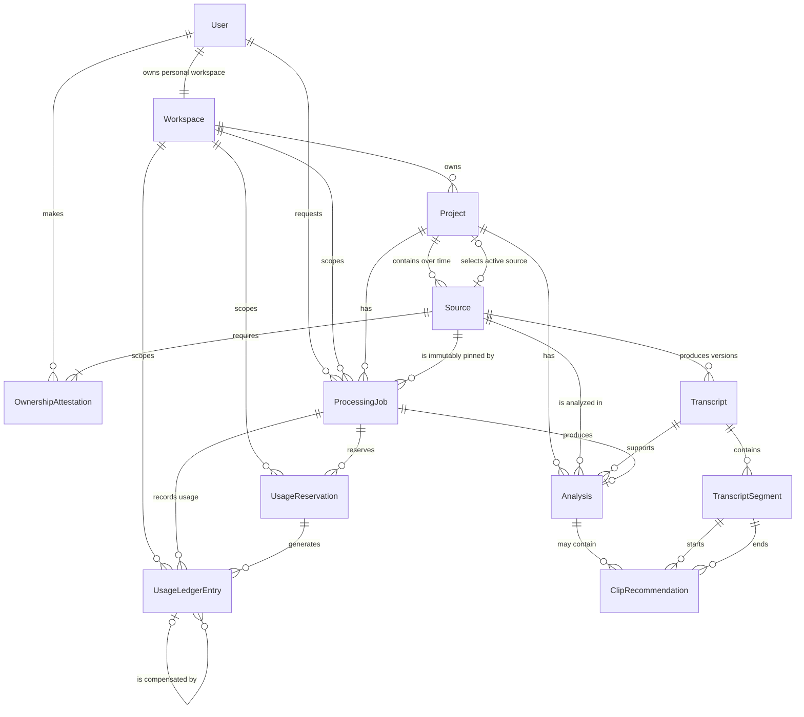

# ClipAI SaaS — Data Model Foundation

## 1. Estado y propósito del documento

| Campo | Valor |
| --- | --- |
| Documento | `04 — Data Model Foundation` |
| Versión | `0.3` |
| Estado | `Approved as initial conceptual model` |
| Estado de implementación | `Partial — User and personal Workspace implemented` |
| Fase | Fase 0 — Foundation |
| Última actualización | 2026-07-13 |

Este documento define el modelo de datos conceptual inicial de ClipAI. Su
propósito es establecer vocabulario, ownership, relaciones, ciclos de vida e
invariantes antes de diseñar un schema físico.

PostgreSQL es el system of record y Prisma ORM 7 implementa el primer schema
físico, limitado a `User` y `Workspace`. Las demás entidades, los detalles de
una futura librería de queue y los controles de recursos privados continúan
siendo conceptuales. Los nombres aquí descritos tampoco constituyen por sí
solos un contrato público de API.

## 2. Principios del modelo de datos

1. **PostgreSQL conserva la verdad del negocio.** El estado de dominio,
   procesamiento y uso debe poder reconstruirse sin depender del estado de un
   provider externo.
2. **Los identificadores internos son autoritativos.** Cada entidad tendrá un
   `id` interno. Los provider identifiers serán referencias secundarias y nunca
   reemplazarán una primary key.
3. **El aislamiento comienza en `Workspace`.** Todo registro privado tendrá
   `workspaceId` o una ruta de ownership inequívoca hacia un `Workspace`. Cuando
   se duplique `workspaceId` para hacer explícito el alcance, deberá coincidir
   con el de todos sus padres.
4. **El servidor decide el tenant.** El backend derivará `workspaceId` desde el
   contexto autenticado y no confiará en un valor arbitrario enviado por el
   cliente.
5. **Las entradas externas no son confiables.** Metadata, transcripts, outputs
   de IA, callbacks y payloads de providers deberán normalizarse y validarse
   antes de convertirse en estado de negocio.
6. **Los resultados conservan trazabilidad.** Un `Analysis` identificará el
   `Source`, la versión de `Transcript`, `promptVersion` y `modelIdentifier`
   usados para producirlo.
7. **Los timestamps provienen de evidencia temporal.** Ningún modelo podrá
   inventar o estimar rangos desde texto sin tiempos. Cada recomendación deberá
   apuntar a `TranscriptSegment` reales y validados.
8. **Los efectos asíncronos son idempotentes.** Un `ProcessingJob` representa
   una operación visible. Las reentregas del queue message podrán ejecutar esa
   operación varias veces sin duplicar resultados ni consumo.
9. **El uso es auditable.** Las reservas son explícitas y los movimientos del
   ledger son append-only. Una corrección crea una entrada compensatoria.
10. **Se minimizan datos y complejidad.** Solo se conservará información
    necesaria para producto, seguridad, soporte y obligaciones aplicables. Las
    decisiones físicas se aplazarán hasta contar con evidencia.

## 3. Diagrama entidad-relación

Por legibilidad, el diagrama no dibuja `Workspace` hacia cada descendiente.
Todos los recursos privados del catálogo conservan el alcance del tenant. Las
cardinalidades dependientes del estado se precisan en la sección 6: por
ejemplo, un `Transcript` en construcción puede no tener segmentos todavía,
pero uno en `ready` debe tener al menos uno. La cardinalidad cero a muchos entre
`Analysis` y `ClipRecommendation` es deliberada: un análisis válido puede
terminar sin recomendaciones.

## 4. Catálogo de entidades

Los campos son conceptuales y deliberadamente mínimos. No fijan tipos SQL,
longitudes, defaults ni nombres definitivos de índices.

### `User`

- **Propósito:** representar la cuenta interna de una persona autenticada.
- **Campos conceptuales:** `id`, `email`, `displayName`, `accountStatus`,
  `authProvider`, `authSubject`, `createdAt`, `updatedAt`, `deletedAt`.
- **Primary ownership:** entidad global de identidad; no pertenece a un tenant.
- **Relaciones:** posee un `Workspace` personal en el MVP, crea
  `OwnershipAttestation` y solicita `ProcessingJob`.
- **Restricciones:** la pareja `authProvider` y `authSubject` deberá ser única
  cuando se defina el modelo de autenticación. La política de unicidad y cambio
  de `email` permanece pendiente.
- **Datos sensibles:** `email`, nombre e identificadores de autenticación son
  PII y requieren acceso mínimo; no se guardarán tokens ni passwords del
  provider.
- **Eliminación:** soft-delete y anonymization. El hard-delete queda restringido
  hasta resolver el workspace, evidencias y registros operativos dependientes.
- **Estado implementado:** `id` y `authSubject` son UUID; `authSubject` es
  obligatorio, privado y único para el único provider autorizado en esta etapa.
  `email` es opcional, no único y nunca participa en identidad o autorización.
  `createdAt` y `updatedAt` se persisten. Los demás campos conceptuales siguen
  diferidos.

### `Workspace`

- **Propósito:** actuar como límite estable de tenant y propietario de recursos
  privados.
- **Campos conceptuales:** `id`, `ownerUserId`, `name`, `workspaceType`,
  `createdAt`, `updatedAt`, `deletedAt`; `workspaceType` será `personal` en el
  MVP.
- **Primary ownership:** lo posee un `User`.
- **Relaciones:** contiene proyectos, jobs, resultados y datos de uso; en el
  futuro podrá relacionarse con varios usuarios mediante `Membership`.
- **Restricciones:** un solo workspace personal por `ownerUserId`; el cambio de
  owner y la conversión a workspace de equipo no pertenecen al MVP.
- **Datos sensibles:** el nombre y la actividad agregada pueden revelar
  información del cliente.
- **Eliminación:** soft-delete y anonymization inicial. El hard-delete será un
  workflow controlado que respetará retención y ledger; no habrá cascade
  inmediata e indiscriminada.
- **Estado implementado:** `id` y `ownerUserId` son UUID; `ownerUserId` es
  obligatorio, único y una foreign key real hacia `User.id`. `name` usa el
  default neutral `Personal workspace`, `workspaceType` solo admite `personal`
  y la eliminación del owner usa `RESTRICT`. La transacción de provisioning
  crea o recupera el par de forma idempotente. La base de datos garantiza como
  máximo un workspace por usuario mediante `UNIQUE(ownerUserId)`; la creación
  operativa del workspace depende del flujo transaccional. La migración
  `20260713180000_identity_foundation` y las nueve pruebas de integración
  verificaron localmente contra PostgreSQL real que se conserva exactamente un
  workspace personal por usuario, incluso con ocho solicitudes concurrentes.
  El workflow de CI incluye un job separado con PostgreSQL 18 efímero que aplica
  la migración mediante `migrate deploy`, comprueba su estado y ejecuta las
  nueve pruebas contra `clipai_test`. La ejecución real en GitHub continúa
  pendiente hasta publicar el commit.

### `Project`

- **Propósito:** organizar el trabajo y el historial asociado a una pieza de
  contenido largo.
- **Campos conceptuales:** `id`, `workspaceId`, `activeSourceId`, `title`,
  `state`, `createdAt`, `updatedAt`, `archivedAt`.
- **Primary ownership:** `Workspace`.
- **Relaciones:** contiene `Source`, `ProcessingJob` y `Analysis`; selecciona
  cero o un `Source` activo.
- **Restricciones:** `activeSourceId`, cuando exista, debe apuntar a un `Source`
  del mismo `Project` y `Workspace` en `accepted`. El MVP permite una sola
  fuente activa, aunque conserva fuentes anteriores para trazabilidad. Cambiar
  la fuente activa es una acción explícita y el siguiente análisis usa un nuevo
  `ProcessingJob`. `state` solo puede ser `draft`, `active` o `archived`: el
  proyecto pasa a `active` cuando tiene una fuente activa aceptada. El estado
  operativo mostrado al usuario se deriva del último job relevante y no se
  duplica en `Project`.
- **Datos sensibles:** título, actividad y asociaciones con fuentes pueden
  revelar clientes o campañas.
- **Eliminación:** `archived` será la opción normal. Un borrado físico posterior
  podrá eliminar contenido dependiente solo tras comprobar restricciones de
  evidencias, jobs y uso.
- **Estado implementado:** `Project` contiene UUID interno, `workspaceId`
  obligatorio, `title` de hasta 160 caracteres, `state`, timestamps y
  `archivedAt` nullable. La foreign key hacia `Workspace.id` usa
  `ON DELETE RESTRICT` y `ON UPDATE CASCADE`. La clave técnica de creación es
  única por workspace para cumplir `Idempotency-Key` sin identificar Projects
  por título. El índice `(workspaceId, updatedAt DESC, id DESC)` respalda el
  listado privado estable. `activeSourceId` permanece fuera del schema hasta una
  tarea posterior que autorice la activación de Sources.
  `20260713184500_project_foundation` fue aplicada localmente a `clipai_test`;
  quince pruebas PostgreSQL verificaron persistencia, scope, idempotencia
  concurrente, nombres duplicados, orden, paginación, foreign key, `RESTRICT` y
  limpieza dirigida.

### `Source`

- **Propósito:** representar una entrada autorizada. En el primer MVP será una
  referencia opaca a un archivo subido por el usuario y almacenado de forma
  privada.
- **Campos conceptuales:** `id`, `workspaceId`, `projectId`, `sourceType`,
  `sourceReference`, `providerName`, `providerSourceId`, `durationMs`, `state`,
  `createdAt`, `updatedAt`, `archivedAt`.
- **Primary ownership:** `Workspace`, dentro de un `Project`.
- **Relaciones:** recibe una o más `OwnershipAttestation`, produce versiones de
  `Transcript` y participa en jobs y análisis.
- **Restricciones:** no puede llegar a `accepted` ni iniciar procesamiento sin
  una attestation válida. `sourceType` será inicialmente `upload` y el formato
  verificado será MP4, MOV, MP3 o WAV. `sourceReference` será una referencia
  opaca a storage, nunca una signed URL duradera ni un nombre elegido como key;
  un provider identifier no sustituye `id`. Una fuente aceptada puede dejar de
  ser activa sin cambiar su estado. No se crea `Asset` porque el archivo no
  tiene todavía un lifecycle de dominio independiente del `Source`.
- **Datos sensibles:** URLs, nombres de archivo, metadata y referencias de
  storage pueden revelar contenido privado.
- **Eliminación:** archive/soft-delete y eliminación coordinada del objeto
  externo. Se restringe el hard-delete mientras existan transcripts, análisis,
  attestations o jobs que deban conservarse.
- **Estado implementado:** `Source` conserva `workspaceId`, `projectId`, tipo
  `upload`, estado inicial `submitted`, transición confirmada a `validating`,
  `safeReference`, `durationMs` nullable, `isActive = false` y timestamps. La foreign key compuesta
  `(projectId, workspaceId) → Project(id, workspaceId)` impide asociaciones
  cross-tenant incluso ante escrituras directas.

### `UploadIntent`

- **Propósito:** registrar la capacidad temporal y todavía incompleta de cargar
  el objeto privado de un único `Source`.
- **Campos implementados:** UUID, scope de workspace y Project, `sourceId`,
  object key opaca, filename y declaraciones de tipo/tamaño, expiración,
  `observedSizeBytes`, `observedContentType`, `storageEtag` y `completedAt`
  nullables antes de confirmar, timestamps y clave idempotente tenant-safe.
- **Restricciones:** `sourceId` y object key son únicos; la relación compuesta
  con Source mantiene los tres IDs coherentes. La URL firmada, credenciales y
  payloads del SDK nunca se persisten. Al confirmar, tamaño y tipo deben
  coincidir exactamente con la declaración y la metadata interna debe ligar el
  objeto con la intención. `storageEtag` es opcional y opaco, no un checksum.
  `expiresAt` limita el target firmado, no impide confirmar un objeto existente.
  La limpieza automática de intenciones expiradas permanece pendiente.

### `OwnershipAttestation`

- **Propósito:** registrar quién confirmó autorización para procesar un
  `Source`, cuándo y bajo qué versión de texto.
- **Campos conceptuales:** `id`, `workspaceId`, `sourceId`, `userId`,
  `statementVersion`, `authorizationBasis`, `attestedAt`, `createdAt`.
- **Primary ownership:** `Workspace`; el actor es un `User`.
- **Relaciones:** pertenece a exactamente un `Source` y a un actor.
- **Restricciones:** una fuente requiere al menos una attestation antes de ser
  aceptada. El registro es evidencia de una declaración del usuario, no una
  garantía legal. Los reenvíos idempotentes no crearán duplicados.
- **Datos sensibles:** vincula identidad, contenido y una declaración con
  posible relevancia legal.
- **Eliminación:** restrict; no se elimina en cascade de forma silenciosa. Si la
  cuenta se anonimiza, se preservará la evidencia mínima exigible según una
  política todavía pendiente.

### `Transcript`

- **Propósito:** representar una versión normalizada y verificable del texto
  temporizado obtenido para un `Source`.
- **Campos conceptuales:** `id`, `workspaceId`, `sourceId`, `version`, `state`,
  `languageCode`, `origin`, `transcriptionMethod`, `providerName`,
  `providerTranscriptId`, `contentChecksum`, `createdAt`, `updatedAt`,
  `completedAt`.
- **Primary ownership:** `Workspace`, por medio del `Source`.
- **Relaciones:** contiene `TranscriptSegment` y puede sustentar varios
  `Analysis`.
- **Restricciones:** `(sourceId, version)` es único. Una versión en `ready` es
  inmutable, contiene segmentos válidos y no puede reemplazarse in place; una
  corrección crea la siguiente versión.
- **Datos sensibles:** texto, idioma, voces y metadata pueden contener datos
  personales, confidenciales o material protegido.
- **Eliminación:** restrict mientras sea referenciado por un análisis. La
  purga, anonymization y representación física del contenido permanecen
  pendientes de la política de retención.

### `TranscriptSegment`

- **Propósito:** asociar texto normalizado a un intervalo temporal real dentro
  de un `Transcript`.
- **Campos conceptuales:** `id`, `workspaceId`, `transcriptId`, `sequence`,
  `startMs`, `endMs`, `text`, `speakerLabel`.
- **Primary ownership:** `Workspace`, por medio del `Transcript` y `Source`.
- **Relaciones:** pertenece a un transcript y puede marcar el inicio o fin de
  múltiples recomendaciones.
- **Restricciones:** `(transcriptId, sequence)` es único; los tiempos son
  enteros, no negativos y cumplen `startMs < endMs`. El orden por `sequence`
  debe ser coherente con el orden temporal.
- **Datos sensibles:** `text` y `speakerLabel` pueden contener PII o contenido
  confidencial.
- **Eliminación:** cascade únicamente cuando el `Transcript` pueda purgarse
  físicamente; de lo contrario, restrict por referencias de recomendaciones.

### `Analysis`

- **Propósito:** conservar el resultado estructurado y validado de una
  operación de análisis.
- **Campos conceptuales:** `id`, `workspaceId`, `projectId`, `sourceId`,
  `transcriptId`, `processingJobId`, `state`, `summary`, `mainTopic`,
  `resultStatus`, `keyPoints`, `promptVersion`, `modelIdentifier`, `outputSchemaVersion`,
  `startedAt`, `completedAt`, `invalidReason`.
- **Primary ownership:** `Workspace`, dentro de un `Project`.
- **Relaciones:** usa exactamente un proyecto, una fuente, una versión de
  transcript y un job; contiene recomendaciones.
- **Restricciones:** `processingJobId` es único. Un análisis `completed` debe
  referenciar un transcript `ready` y una fuente del mismo proyecto.
  `resultStatus` será `recommendations_found` cuando exista al menos una
  recomendación válida y `no_recommendations` cuando no exista ninguna. Ambos
  resultados son válidos: si ningún momento cumple los criterios de calidad,
  el sistema no obliga a la IA a fabricar recomendaciones. Una respuesta de IA
  inválida no puede persistirse como resultado completado.
- **Datos sensibles:** resumen, tema, modelo usado y razones de invalidación
  pueden revelar el contenido procesado. No se conservará el prompt completo
  por defecto.
- **Eliminación:** ocultamiento o soft-delete para el usuario. El hard-delete
  se restringe mientras el job o las obligaciones de retención lo requieran;
  sus recomendaciones podrán eliminarse en cascade cuando proceda.

### `ClipRecommendation`

- **Propósito:** describir un momento priorizado y verificable como candidato a
  contenido corto.
- **Campos conceptuales:** `id`, `workspaceId`, `analysisId`, `rank`,
  `startSegmentId`, `endSegmentId`, `startMs`, `endMs`, `title`, `hook`,
  `callToAction`, `hashtags`, `derivedPostIdeas`, `platforms`, `rationale`,
  `createdAt`.
- **Primary ownership:** `Workspace`, por medio del `Analysis`.
- **Relaciones:** pertenece a un análisis y usa dos segmentos de la misma
  versión de transcript como límites temporales.
- **Restricciones:** `(analysisId, rank)` es único. Solo se crea después de
  validar el análisis; los rangos deben estar ordenados y respaldados por sus
  segmentos. `rank` expresa prioridad editorial, no probabilidad garantizada de
  rendimiento o viralidad.
- **Datos sensibles:** título, hook y rationale derivan del contenido privado.
- **Eliminación:** cascade cuando el `Analysis` pueda borrarse físicamente; no
  puede sobrevivir sin su análisis.

### `ProcessingJob`

- **Propósito:** representar una operación de procesamiento solicitada por el
  usuario y su estado visible y durable.
- **Campos conceptuales:** `id`, `workspaceId`, `projectId`, `sourceId`,
  `requestedByUserId`, `operation`, `state`, `requestIdempotencyKey`,
  `currentStage`, `safeErrorCode`, `safeErrorMessage`, `createdAt`, `startedAt`,
  `completedAt`.
- **Primary ownership:** `Workspace`.
- **Relaciones:** pertenece a un proyecto y una fuente, puede producir un
  análisis y tiene reservas y entradas de ledger.
- **Restricciones:** la clave `(workspaceId, operation,
  requestIdempotencyKey)` identifica una sola solicitud. Un queue message solo
  referencia este job; sus retries no crean otro registro. `sourceId` queda
  fijado al crear el job y nunca se reemplaza silenciosamente. Una URL, archivo,
  audio o transcript temporizado alternativo crea otro `Source` y otro
  `ProcessingJob` en el mismo proyecto. Errores visibles no contendrán secretos
  ni payloads sensibles.
- **Datos sensibles:** metadata operativa, identidad del solicitante y errores
  pueden revelar actividad o contenido.
- **Eliminación:** restrict y retención operativa. No se elimina en cascade con
  el proyecto mientras sustente trazabilidad o movimientos de uso.

### `UsageReservation`

- **Propósito:** apartar temporalmente capacidad antes de iniciar costes
  externos para un `ProcessingJob`.
- **Campos conceptuales:** `id`, `workspaceId`, `processingJobId`, `sequence`,
  `state`, `quantity`, `unit`, `idempotencyKey`, `expiresAt`, `createdAt`,
  `closedAt`.
- **Primary ownership:** `Workspace`.
- **Relaciones:** pertenece a un job y genera entradas de ledger.
- **Restricciones:** un job puede tener reservas secuenciales si una anterior
  expira, pero como máximo una estará `active` y como máximo una llegará a
  `settled`. `quantity` no puede ser negativa y `unit` debe coincidir con las
  entradas relacionadas.
- **Datos sensibles:** revela consumo y límites comerciales del workspace.
- **Eliminación:** restrict. Después de alcanzar un estado terminal se conserva
  según la política financiera y operativa pendiente.

### `UsageLedgerEntry`

- **Propósito:** registrar de forma inmutable cada evento que afecte reserva,
  consumo, liberación, expiración o ajuste.
- **Campos conceptuales:** `id`, `workspaceId`, `processingJobId`,
  `usageReservationId`, `eventKey`, `entryType`, `quantity`, `unit`,
  `compensatesEntryId`, `occurredAt`, `createdAt`.
- **Primary ownership:** `Workspace`.
- **Relaciones:** pertenece a un job; normalmente pertenece a una reserva y
  opcionalmente compensa otra entrada.
- **Restricciones:** `eventKey` es único. Las entradas son append-only y no se
  actualizan ni eliminan para corregir saldos. `entryType` distinguirá
  conceptualmente `reservation`, `settlement`, `release`, `expiration`,
  `adjustment_credit` y `adjustment_debit`.
- **Datos sensibles:** contiene historial de uso y posibles implicaciones
  comerciales; no debe incluir payloads de providers ni PII innecesaria.
- **Eliminación:** restrict. Las correcciones usan entradas compensatorias; la
  retención y anonymization definitivas se decidirán antes del lanzamiento.

## 5. Reglas de ownership y tenancy

- `User` es la raíz de identidad; `Workspace` es la raíz del tenant.
- En el MVP, un `User` posee exactamente un `Workspace` personal y un workspace
  tiene exactamente un owner.
- `Project`, `Source`, `OwnershipAttestation`, `Transcript`,
  `TranscriptSegment`, `Analysis`, `ClipRecommendation`, `ProcessingJob`,
  `UsageReservation` y `UsageLedgerEntry` se consideran privados y conservan
  `workspaceId` conceptualmente.
- Una relación entre dos registros privados solo es válida si ambos pertenecen
  al mismo workspace. Esto incluye referencias denormalizadas como
  `activeSourceId`, `startSegmentId` y `endSegmentId`.
- El servidor resolverá el workspace desde la sesión y comprobará acceso antes
  de leer o escribir. El cliente podrá usar identificadores de recursos, pero
  no elegir libremente el tenant de la operación.
- Toda consulta privada aplicará el filtro de workspace aunque el identificador
  interno sea globalmente único. Las pruebas futuras deberán cubrir acceso
  cruzado entre tenants.
- `Membership` y `Role` permitirán equipos más adelante. Hasta que existan, no
  se inferirán permisos compartidos ni se añadirá colaboración avanzada.

## 6. Relaciones y cardinalidades

| Relación | Cardinalidad conceptual | Regla |
| --- | --- | --- |
| `User` — `Workspace` | 1:1 en el MVP | Un usuario posee un workspace personal. |
| `Workspace` — recursos privados | 1:N | El workspace es owner de todo el grafo privado. |
| `Project` — `Source` | 1:N a lo largo del tiempo | El MVP permite como máximo un `activeSourceId`; las anteriores y los fallbacks se conservan como historial. |
| `Source` — `OwnershipAttestation` | 1:1..N | Debe existir al menos una attestation válida antes de `accepted`. |
| `Source` — `Transcript` | 1:0..N | Cada transcript tiene un `version` inmutable dentro de la fuente. |
| `Transcript` — `TranscriptSegment` | 1:0..N | En `ready` debe contener al menos un segmento válido y ordenado. |
| `Project` — `ProcessingJob` | 1:0..N | Cada inicio de análisis crea un job; un fallback con otra entrada crea otro job dentro del mismo proyecto. |
| `ProcessingJob` — `Analysis` | 1:0..1 | El job puede terminar sin resultado; un análisis pertenece a un solo job. |
| `Project`/`Source`/`Transcript` — `Analysis` | 1:0..N | Cada análisis fija exactamente uno de cada padre y todos deben ser coherentes. |
| `Analysis` — `ClipRecommendation` | 1:0..N | Un análisis `completed` puede tener cero recomendaciones cuando ninguna cumple los criterios de calidad. |
| `TranscriptSegment` — `ClipRecommendation` | 1:0..N por límite | Cada clip referencia un segmento inicial y otro final del transcript analizado. |
| `ProcessingJob` — `UsageReservation` | 1:0..N secuencial | Solo una reserva activa y, en toda la vida del job, como máximo una liquidada. |
| `ProcessingJob` — `UsageLedgerEntry` | 1:0..N | Cada efecto de uso del job tiene una entrada idempotente. |
| `UsageReservation` — `UsageLedgerEntry` | 1:1..N al producir efectos | Reserva, cierre y posibles correcciones quedan auditados. |

## 7. Estados y transiciones permitidas

Los nombres de estados son conceptuales, pueden refinarse antes de la
implementación y todavía no forman un contrato público de API. Las transiciones
deben realizarse server-side y validar el estado previo.

### `Project`

| Desde | Hacia | Condición principal |
| --- | --- | --- |
| `draft` | `active` | Existe un `Source` activo y aceptado con attestation. |
| `draft` | `archived` | El usuario abandona el borrador. |
| `active` | `archived` | Se cancelan o cierran de forma segura los jobs no terminales. |

`Project.state` solo usa `draft`, `active` y `archived`. Un proyecto permanece
`active` mientras se ejecutan, completan, fallan o reemplazan análisis. El
frontend deriva `queued`, `processing`, `awaiting_input`, `completed`, `failed`
o `cancelled` del último `ProcessingJob` relevante en lugar de duplicar ese
estado en `Project`. `archived` no tiene salida en el MVP.

### `Source`

`submitted → validating → accepted | rejected`. `accepted` y `rejected` son
terminales para ese registro. `awaiting_input` pertenece exclusivamente a
`ProcessingJob`. Reemplazar una fuente crea otro `Source`; que una fuente deje
de ser activa no altera su estado. Otro archivo soportado se registra como una
fuente nueva, no como una mutación de la original.

La confirmación de metadata implementa únicamente `submitted → validating`.
Una actualización condicional de `UploadIntent.completedAt` elige una sola
observación concurrente y la misma transacción corta avanza el Source; `HEAD`
ocurre antes de abrirla. Confirmar no demuestra MIME real, no crea una
`OwnershipAttestation`, no acepta y no activa la fuente.

### `ProcessingJob`

`queued → processing | cancelled`, `processing → awaiting_input | completed |
failed | cancelled` y `awaiting_input → cancelled`. `completed`, `failed` y
`cancelled` son terminales; un nuevo intento o una entrada alternativa crea
otro `ProcessingJob`. Cada job conserva de forma inmutable el `sourceId` para el
que nació. Los retries técnicos del queue message ocurren sobre el mismo job y
no crean jobs de dominio.

En el primer flujo basado en upload, `pending` y `uploaded` son etapas visibles
derivadas de `Source` y del objeto privado antes de `queued`; no se añaden al
enum de `ProcessingJob`. `currentStage` comunica subetapas como transcripción y
análisis sin convertirlas en estados terminales.

### `Transcript`

`pending → processing` y `processing → ready | invalid | failed`. También se
permite `pending → failed` si la adquisición no puede comenzar. `ready`,
`invalid` y `failed` son terminales e inmutables; una corrección o nueva
adquisición crea otra versión.

### `Analysis`

`pending → processing` y `processing → completed | invalid | failed`. También
se permite `pending → failed` si el análisis no puede comenzar. Los tres estados
finales son terminales. `invalid` indica que el output no superó la validación;
no representa un resultado utilizable. Un análisis `completed` puede tener
`resultStatus = recommendations_found` y una o más recomendaciones, o
`resultStatus = no_recommendations` y ninguna. La ausencia válida de momentos
no se corrige fabricando recomendaciones.

### `UsageReservation`

`active → settled | released | expired`. Todos los destinos son terminales. Si
una reserva expira mientras un job espera input, una continuación autorizada
crea una nueva reserva secuencial; no reactiva la anterior.

### Coherencia entre agregados

- Un job en `completed` exige `Analysis.completed`, `Transcript.ready`, un
  `resultStatus` coherente con el número de recomendaciones y una única
  liquidación de uso. Cero recomendaciones es un resultado válido.
- Un job en `awaiting_input` no ocupa un worker. El proyecto continúa `active` y
  el frontend muestra el estado derivado del job.
- Si el usuario aporta una fuente alternativa, el backend cancela el job en
  `awaiting_input`, libera su reserva activa idempotentemente y crea un nuevo
  `Source` y un nuevo `ProcessingJob` dentro del mismo proyecto. El `sourceId`
  del job anterior no cambia.
- Un job `failed` o `cancelled` sin resultado válido libera cualquier reserva
  activa de forma idempotente. La política sobre costes parciales del provider
  no cambia silenciosamente el consumo del usuario y permanece pendiente.

## 8. Invariantes de uso, reservas y ledger

1. Un `ProcessingJob` no puede liquidar uso más de una vez, incluso si tuvo
   varias reservas secuenciales.
2. Solo puede existir una `UsageReservation.active` por job. Una reserva nueva
   requiere que la anterior esté `released` o `expired`.
3. Un job solo puede entrar en procesamiento con capacidad reservada. Si la
   reserva falla, no comienza trabajo externo que genere coste.
4. Crear, liquidar, liberar o expirar una reserva genera un
   `UsageLedgerEntry` con `eventKey` único.
5. La liquidación cambia la reserva y registra el movimiento correspondiente en
   una única transacción. Un retry observa el efecto existente y no lo repite.
6. Un job sin resultado válido libera la reserva. Cualquier futura política de
   coste parcial deberá aprobarse y expresarse mediante entradas explícitas.
7. Los ledger entries son append-only. No se editan cantidades, tipos, unidades
   ni relaciones después de persistirse.
8. Un error se corrige con `adjustment_credit` o `adjustment_debit` que referencia
   `compensatesEntryId`; nunca con una reescritura histórica.
9. La unidad de una reserva, su liquidación y sus ajustes relacionados debe ser
   idéntica. La unidad comercial concreta queda pendiente.
10. El balance autoritativo se deriva del ledger y la disponibilidad considera
    además reservas activas. Un cache o snapshot futuro será reconstruible y no
    podrá ser la única fuente de verdad.

## 9. Reglas de idempotencia y unicidad

| Alcance | Regla conceptual |
| --- | --- |
| Workspace personal | `ownerUserId` es único para `workspaceType = personal`. |
| Solicitud de procesamiento | `(workspaceId, operation, requestIdempotencyKey)` identifica un único `ProcessingJob`. Repetir el request devuelve o reutiliza el resultado previo. |
| Fuente activa | `Project.activeSourceId` expresa la única fuente activa y debe pertenecer al mismo proyecto y workspace. |
| Fuente fijada por job | `ProcessingJob.sourceId` es inmutable. Un fallback registra otra fuente y otro job; nunca redirige el anterior. |
| Attestation | El comando de creación usa una clave idempotente del request; repetir la misma aceptación no crea otra evidencia. |
| Versión de transcript | `(sourceId, version)` es único y una versión terminal no se sobrescribe. |
| Orden de segmentos | `(transcriptId, sequence)` es único. |
| Resultado por job | `Analysis.processingJobId` es único. |
| Orden de clips | `(analysisId, rank)` es único. |
| Reserva | `UsageReservation.idempotencyKey` es única dentro del workspace; un índice condicional físico deberá asegurar como máximo una reserva activa por job. |
| Liquidación | Solo una reserva de un job puede llegar a `settled`; el `eventKey` de liquidación también impide duplicados. |
| Ledger | `UsageLedgerEntry.eventKey` es único y representa un solo efecto semántico, por ejemplo `reserve:<reservationId>` o `settle:<processingJobId>`. |
| Queue retry | Todos los mensajes y reintentos cargan el mismo `ProcessingJob`; antes de cada efecto consultan estado durable y claves únicas. |
| Providers futuros | Los identifiers externos se hacen únicos solo dentro de su provider y tipo cuando su contrato lo garantice; no sustituyen IDs internos. |
| Webhooks futuros | La combinación de provider y external event identifier será idempotente antes de aplicar efectos de negocio. |

La creación de clips deberá ser repetible: la escritura transaccional del
resultado reutiliza el análisis del job y sus ranks, o detecta que ya está
completo, sin insertar recomendaciones duplicadas.

## 10. Integridad de transcripts y timestamps

- Los tiempos se expresarán conceptualmente como enteros en milisegundos:
  `startMs >= 0`, `endMs > startMs`.
- `sequence` define un orden determinista dentro del transcript. El orden
  temporal debe ser no decreciente y cualquier overlap o gap real debe
  conservarse, no ocultarse mediante tiempos inventados.
- Un transcript `ready` debe tener al menos un segmento con texto no vacío y
  tiempos válidos. Los segmentos se vuelven inmutables junto con esa versión.
- `contentChecksum` podrá ayudar a detectar contenido repetido o alterado, pero
  no reemplaza el versionado ni la validación.
- Un análisis solo puede comenzar con un transcript `ready` perteneciente al
  mismo `Source` registrado en el job.
- Una recomendación debe usar `startSegmentId` y `endSegmentId` del transcript
  del análisis, con el segmento inicial anterior o igual al final.
- `startMs` y `endMs` de la recomendación son valores canónicos derivados y
  validados contra esos segmentos. Si posteriormente se admite precisión
  interna a un segmento, deberá provenir de una alineación verificable, nunca
  de una estimación libre del modelo.
- El rango recomendado no puede atravesar contenido que el sistema presente
  como respaldado si no existen segmentos temporizados que lo sustenten. Los
  gaps se conservan como tales.
- Un análisis `completed` no puede referenciar un transcript `invalid` o
  `failed`. Invalidar evidencia después de usarla requeriría una decisión de
  dominio explícita, no una mutación silenciosa del transcript.
- Los payloads de transcripción y de IA son datos no confiables. El servidor
  valida schema, tipos, límites y coherencia referencial antes de persistir
  estado final.

## 11. Eliminación, retención y anonymization

La eliminación lógica, la retirada de acceso y la purga física son operaciones
distintas. `archivedAt` o `deletedAt` no prueban que el contenido haya sido
eliminado de PostgreSQL, object storage, providers o backups.

- Una solicitud de eliminación de `User` deshabilitará acceso y aplicará
  anonymization a PII cuando sea compatible con evidencias y obligaciones de
  retención.
- Eliminar un `Workspace` será un workflow explícito: bloquear nuevas
  operaciones, cancelar jobs seguros, liberar reservas, retirar acceso, purgar
  contenido elegible y conservar o anonimizar registros restringidos.
- `Project` y `Source` se archivarán normalmente. La referencia a un objeto
  externo y el objeto mismo deberán eliminarse de forma coordinada e
  idempotente.
- `Transcript`, segmentos, análisis y recomendaciones pueden contener el
  material más sensible. Su retención será mínima y la purga respetará las
  dependencias que aún prueben resultados o incidentes.
- `OwnershipAttestation`, `ProcessingJob`, `UsageReservation` y
  `UsageLedgerEntry` no se borrarán en cascade. Se conservará la mínima
  información necesaria y se anonimizarán referencias personales cuando sea
  posible.
- Las entradas de ledger permanecen append-only durante su periodo de
  retención. Eliminar una cuenta no autoriza a alterar movimientos históricos.
- La purga deberá considerar copias de seguridad, caches, logs, providers y
  object storage. Sus plazos y procedimientos permanecen pendientes.
- Antes del lanzamiento deben aprobarse periodos por categoría de datos,
  motivos de retención, tratamiento de backups, residencia y respuesta a
  solicitudes de acceso o eliminación.

Este documento no configura cascades físicas. Cada una deberá revisarse al
diseñar el schema y las políticas definitivas.

## 12. Estrategia conceptual de índices

Los índices finales dependerán de queries y volúmenes medidos. El punto de
partida conceptual es:

- primary key en cada `id` e índices en todas las foreign keys.
- índices que comiencen por `workspaceId` para listados privados y combinen el
  estado o fecha usados por la consulta, no índices aislados de baja
  cardinalidad.
- `Project(workspaceId, state, updatedAt)` para listar proyectos `draft`,
  `active` o `archived`; no se usará para representar progreso operativo.
- `Source(workspaceId, projectId, createdAt)` y soporte eficiente para validar
  `activeSourceId`.
- índice único `Transcript(sourceId, version)` e índice de consulta
  `(workspaceId, sourceId, state)`.
- índice único `TranscriptSegment(transcriptId, sequence)`; se evaluará un
  índice temporal adicional solo ante queries reales.
- índice único `Analysis(processingJobId)` e índice
  `(workspaceId, projectId, createdAt)`.
- índice único `ClipRecommendation(analysisId, rank)`.
- índice único de idempotencia de `ProcessingJob`, índice
  `(workspaceId, projectId, createdAt)` para obtener el último job relevante e
  índice `(workspaceId, state, createdAt)` para polling y operación.
- índices de `UsageReservation` por `(processingJobId, state)` y `expiresAt`,
  más constraints parciales para una reserva activa y una liquidada por job.
- índice único `UsageLedgerEntry(eventKey)` e índice
  `(workspaceId, occurredAt)` para reconstrucción y consulta del ledger.

No se proponen aún full-text indexes, particionamiento, JSON indexes ni índices
específicos de provider. Se añadirán solo por necesidad funcional y evidencia
de rendimiento.

## 13. Límites transaccionales

1. **Creación de proyecto.** Un comando idempotente crea solo el `Project` en
   `draft` dentro del workspace autenticado. No crea fuente, job, reserva ni
   queue message.
2. **Registro de fuente y attestation.** Otra transacción idempotente crea el
   `Source` y su `OwnershipAttestation`, comprobando que usuario, proyecto y
   workspace sean coherentes. Esta operación no reserva uso ni entrega trabajo
   al queue.
3. **Aceptación y activación de fuente.** Aceptar o reemplazar `activeSourceId`
   bloqueará el proyecto para evitar carreras y comprobará attestation, estado
   y ownership. Al seleccionar la primera fuente aceptada, `Project` pasa de
   `draft` a `active`. La fuente de cualquier job existente permanece intacta.
4. **Inicio de análisis.** Solo una solicitud explícita de análisis crea, en una
   transacción idempotente, un `ProcessingJob` con `sourceId` inmutable y su
   `UsageReservation`. Esta es la única de las operaciones anteriores que
   reserva uso y habilita la entrega al queue.
5. **Entrega al queue.** El commit del job y la reserva, y la publicación del
   queue message deberán coordinarse con las garantías de la librería
   PostgreSQL-backed elegida. Si no admite una transacción compartida, deberá
   existir un handoff durable y recuperable. La técnica concreta sigue
   pendiente y no se diseñará un queue engine propio.
6. **Persistencia del transcript.** La versión y sus segmentos se guardarán como
   una unidad consistente antes de pasar a `ready`. Un fallo no dejará un
   transcript listo con segmentos parciales.
7. **Finalización válida.** Tras validar todo fuera de la transacción cuando sea
   posible, una transacción corta persistirá o finalizará `Analysis`, fijará
   `resultStatus`, escribirá cero o más `ClipRecommendation` y actualizará el
   estado del job, la liquidación de la reserva y el ledger correspondiente.
   `Project.state` no duplica el resultado del job.
8. **Fallback o reemplazo.** La entrada alternativa se registra primero como un
   nuevo `Source` con su attestation. Tras validarlo y activarlo, al iniciar su
   análisis el backend bloquea el job anterior en `awaiting_input`, lo cambia a
   `cancelled`, libera su reserva activa con ledger idempotente y crea el nuevo
   job y su reserva. El job anterior conserva su `sourceId`; el frontend puede
   presentar el flujo como continuidad del mismo proyecto.
9. **Fallo o cancelación.** El cambio terminal del job, la liberación de una
   reserva activa y su ledger se coordinarán idempotentemente. El proyecto
   permanece `active` y un retry encuentra el cierre ya aplicado.
10. **Expiración de reserva.** Expirar una reserva y registrar su ledger será
   atómico. Crear una reserva posterior comprobará bajo lock que no existe otra
   activa ni una liquidación previa del job.
11. **Correcciones de uso.** Una entrada compensatoria y cualquier cambio
   derivado de disponibilidad se aplicarán en una transacción sin editar la
   entrada original.

Las llamadas largas a providers no permanecerán dentro de transacciones de
base de datos. Cada etapa confirmará primero el estado durable esperado y
persistirá efectos pequeños, recuperables e idempotentes.

## 14. Datos que no deben almacenarse

ClipAI no almacenará:

- passwords en texto plano, API keys, access tokens, refresh tokens, secrets de
  webhook ni credenciales de providers dentro de registros de dominio;
- secretos reales en el repositorio, documentación, fixtures o logs;
- signed URLs de larga duración cuando baste una referencia opaca y acceso
  temporal generado server-side;
- archivos grandes de video o audio dentro de PostgreSQL;
- tablas, heartbeats, leases, retries o mensajes internos de la librería de
  queue como parte del modelo de dominio de ClipAI;
- provider identifiers como primary keys internas;
- balances mutables como única fuente de verdad ni cambios de consumo sin
  ledger entry;
- outputs de IA o transcripción sin validar como resultados autoritativos;
- transcripts completos, prompts completos, archivos, tokens o payloads
  sensibles en logs por defecto;
- copias de transcripts obtenidas mediante scraping no autorizado;
- PII, metadata, payloads de webhooks o respuestas crudas de providers que no
  sean necesarios para una finalidad aprobada;
- razonamiento oculto del modelo ni datos promocionados como garantía de
  viralidad.

La ubicación física de transcripts completos todavía está pendiente. Estén en
PostgreSQL o storage externo, se les aplicarán las mismas reglas de acceso,
minimización, retención y eliminación.

## 15. Entidades MVP frente a entidades futuras

### Entidades del modelo MVP

| Entidad | Motivo de inclusión |
| --- | --- |
| `User` | Identidad interna y actor autenticado. |
| `Workspace` | Tenancy personal preparado para evolución futura. |
| `Project` | Contenedor del trabajo y su historial. |
| `Source` | Entrada autorizada y reemplazable con trazabilidad. |
| `OwnershipAttestation` | Evidencia de la confirmación del usuario. |
| `Transcript` | Versión temporizada utilizada por el análisis. |
| `TranscriptSegment` | Evidencia textual y temporal verificable. |
| `Analysis` | Resultado estructurado validado y versionado. |
| `ClipRecommendation` | Unidad principal de valor editorial. |
| `ProcessingJob` | Estado durable y visible del procesamiento asíncrono. |
| `UsageReservation` | Control previo de capacidad y coste. |
| `UsageLedgerEntry` | Historial autoritativo e inmutable de uso. |

### Conceptos futuros o deferred

| Entidad | Responsabilidad futura | Límite actual |
| --- | --- | --- |
| `Membership` | Relacionar usuarios y workspaces de equipo. | No hay invitaciones ni múltiples miembros en el MVP. |
| `Role` | Agrupar permisos de colaboración. | El owner personal conserva el único acceso. |
| `Plan` | Definir oferta, límites y unidades comerciales. | Modelo comercial pendiente. |
| `Subscription` | Relacionar workspace, plan y estado comercial. | No se selecciona billing provider. |
| `Payment` | Conservar referencias de cobros y conciliación. | El ledger de uso no depende de pagos. |
| `WebhookEvent` | Recibir callbacks autenticados e idempotentes. | Se definirá con cada integración. |
| `UsageEvent` | Capturar metering técnico detallado si fuera necesario. | No sustituirá `UsageLedgerEntry` como verdad comercial. |
| `ApiKey` | Autorizar una API pública o integraciones. | La API pública es non-goal del MVP. |
| `Export` | Representar una entrega generada y su lifecycle. | El MVP presenta recomendaciones, no automatiza exports complejos. |
| `AuditLog` | Registrar acciones de seguridad y administración. | No se creará un event-sourcing genérico anticipado. |

Estas entidades futuras no deben añadirse al schema MVP hasta que su
funcionalidad sea autorizada y se definan sus invariantes.

## 16. Riesgos y decisiones de datos no resueltas

| Tema | Riesgo o decisión pendiente | Tratamiento provisional |
| --- | --- | --- |
| Authentication | Supabase Auth está aprobado; session lifecycle, cambio de email y recuperación detallada siguen pendientes. | Mantener `User.id` interno y referencias externas secundarias; no guardar passwords ni tokens. |
| Source inputs | Upload MP4, MOV, MP3 y WAV está aprobado; idiomas y duración máxima siguen pendientes. | Usar `sourceType = upload`, referencia opaca y límite provisional de 250 MiB; la confirmación verifica metadata de storage, pero bytes y MIME real siguen pendientes. |
| Object storage | Interfaz privada S3-compatible aprobada; provider, región y lifecycle siguen pendientes. | No guardar binarios grandes en PostgreSQL ni signed URLs duraderas. |
| Transcript storage | Falta decidir si texto completo y segmentos vivirán íntegramente en PostgreSQL o usarán storage externo. | PostgreSQL conserva metadata, relaciones, estado y referencias autoritativas. |
| Calidad temporal | Overlaps, gaps, precisión y tolerancias dependen del mecanismo real de transcripción. | Exigir milisegundos válidos, orden y respaldo verificable; no inventar tiempos. |
| AI identity | OpenAI está aprobado inicialmente; modelo, parámetros, schema final y prompts están pendientes. | Persistir versiones internas `promptVersion`, `modelIdentifier` y `outputSchemaVersion`. |
| Billing unit | No están definidos créditos, minutos, coste, precio ni tratamiento comercial de parciales. | Ledger agnóstico mediante `quantity` y `unit`; jobs sin resultado liberan reserva. |
| Reservation expiry | Duración, renovación y experiencia de reanudación no están definidas. | Permitir reservas secuenciales, solo una activa y una liquidación por job. |
| Retention | Faltan periodos para contenido, PII, logs, attestations, ledger y backups. | Soft-delete, minimización y hard-delete restringido hasta aprobar la política. |
| Attestation | Texto legal, versión, revocación y evidencia suficiente requieren revisión. | Guardar actor, fuente, versión y fecha sin presentarlo como garantía legal. |
| Queue handoff | La librería PostgreSQL-backed y su soporte transaccional no están elegidos. | Exigir entrega durable e idempotente sin modelar tablas internas. |
| Active source | La concurrencia al reemplazar una fuente puede mezclar resultados. | El MVP fija un solo `activeSourceId`, usa lock transaccional, mantiene inmutable el `sourceId` de cada job y cancela el job anterior antes de procesar el fallback. |
| Deletion | Purga coordinada entre DB, storage, providers y backups puede quedar incompleta. | Diseñar un workflow idempotente y auditable antes del lanzamiento. |
| Growth | Segments y ledger pueden crecer más rápido que otros datos. | Medir volumen y queries antes de particionar o añadir índices especializados. |

Estas decisiones deberán resolverse en documentación y ADRs antes de fijar el
schema físico correspondiente. Este documento no afirma que el modelo esté
implementado.
